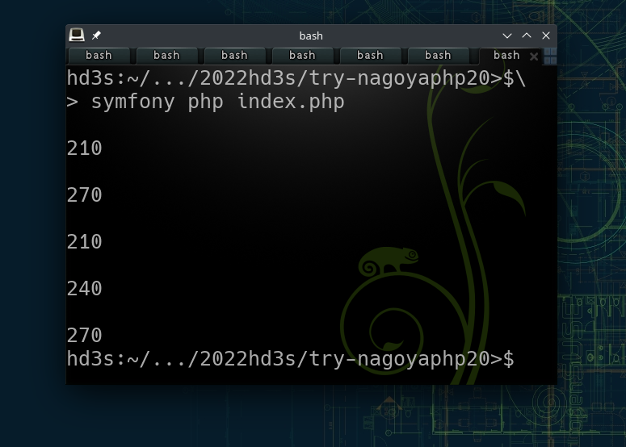
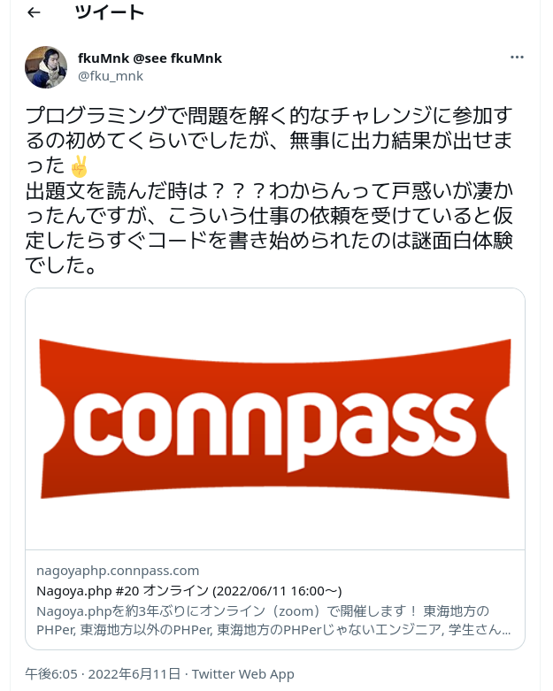

# 実装コード：Nagoya.php＃20 オンライン

2022年6月11日にオンラインで開催されたNagoya.php第20回でのプログラミング問題に対する解答コードです。

[Nagoya.php #20 オンライン - connpass](https://nagoyaphp.connpass.com/event/249120/)

## 実行方法

index.phpを実行すると結果が表示されます。

;

## 出題：N市地下鉄の料金を求める

[問題およびテストデータ](https://gist.github.com/77web/e6dbfa787d64fbdc8b7a32e2ad3320d3)

上記問題に対する解答を、16:10〜17:10の間で参加者各自が実装を行いました。

## 実装コードの解説

34行目までのコードは、問題を順番に理解していくための過程で書かれたコードです。
コメントを残しながら進めればよかったのでは？と後から気がついたんですが、**緊張していたので**言葉として言語化できていませんでした。

35行目からが実装コードで、サンプルデータの値を受け取って結果を返す関数です。

62行目でサンプルデータを受け取って、64行目のループで全ての値の計算結果を出力しています。

結果を返す関数usoEkiNetは、サンプルデータの各値から、路線データと料金の検証データを受け取ります。
路線データの文字列を順番に分解して、駅名と区間ポイント【変数$b】、始点終点駅名【変数$c】を求めます。

駅名と区間ポイントをループさせて、値が始点に達したとき、ポイント加算フラグ【変数$check】にstartフラグを指定します。
フラグがstartの間、ループ内では値を整数に型キャストして累積区間ポイント【変数$number】に加算します。このとき駅名は整数形式の文字列ではないので0が加算されます。
値が終点に達するとフラグにendを指定して、累積区間ポイントへの加算を停止します。
最後に累積加算ポイントを、運賃表と照らし合わせ、料金が検証データ【変数$answer】と一致しているかを判定し、一致すれば料金を、一致しなければnullを返します。

## 感想

[Twitter](https://twitter.com/fku_mnk/status/1535548826618318848)

あと、いつも突然コードを書き始めるので、上記の解説みたいにまずは母国語で出力してからコードを書き始めたほうが頭の負担が軽くなるのかもとおもいました。
